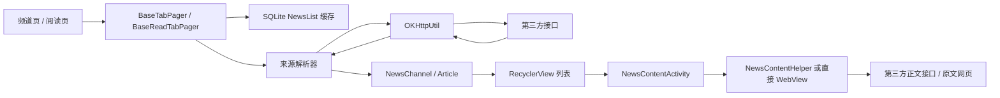

# News Nook 新闻源获取与解析维护文档

> 基线：`base.apk`，包名 `com.xio.cardnews`，版本 `1.0.9 (11)`  
> 原版本：`minSdk 16`，`targetSdk 24`  
> 分析日期：2026-07-31  
> 文档目的：记录旧版真实的数据链路、来源归属、解析规则和当前失效点，为重新维护、替换数据源和修复崩溃提供依据。

**文档结构**：本文分两部分。§1–§17 是旧版 APK 的逆向分析，仅作历史参考；**现行内置源以 `src/sources/registry.ts` 为准**，其总览、探测笔记与对旧章节结论的修正见 **§18–§19**。旧章节与现行实现冲突时（如知乎日报、果壳），以 §19.2 为准。

## 1. 结论摘要

旧版客户端没有自己的新闻服务端。客户端直接访问网易新闻、知乎日报、果壳精选、豆瓣一刻和锤子阅读的接口或网页，再把不同来源的数据统一转换成列表模型。

现状可以概括为：

- 网易的大部分频道列表和正文接口仍能返回数据。
- 网易“智能”“暴雪游戏”“彩票”三个频道目前返回空数组，旧代码会在 `list.get(0)` 处崩溃。
- 网易汽车接口仍返回数据，但 JSON 顶层结构已经变化，旧版固定下标截取逻辑无法解析。
- 网易首页动态背景图接口目前返回 404。
- 知乎日报旧域名、果壳旧接口、豆瓣一刻和锤子阅读接口均不能继续视为稳定可用的数据源。
- 旧代码大量依赖 `get(0)`、`get(size - 1)`、固定 `substring(...)` 和 URL 字符串判断来源，任何空响应或结构变化都可能导致崩溃。
- “文章来源”在不同源中的含义不统一。重新维护时应把平台、媒体名称、作者和原文 URL 分开保存。

## 2. 总体数据流



列表页的基本过程：

1. 根据频道 URL 中是否包含 `163`、`zhihu`、`guokr`、`douban` 判断来源类型。
2. 启动时先按完整 URL 查询 SQLite 缓存。
3. 有缓存则立即解析并显示。
4. 有网络时再请求远端数据。
5. 请求成功后删除同 URL 的旧缓存，保存新 JSON。
6. 各来源解析器把数据转成 `NewsChannel` 或 `Article`。
7. 点击文章后，把文章 ID、来源、图片、标题、原文链接等通过 `Intent` 传给详情页。

详情页存在两种模式：

- 聚合新闻模式：根据来源请求正文 API，再拼装成本地 HTML。
- 锤子阅读模式：直接用 WebView 打开返回的 `origin_url`。

## 3. 相关代码职责

以下是 APK 反编译后的原始类名。部分包名经过 ProGuard 混淆，但核心业务类名仍保留。

| 类 | 职责 |
|---|---|
| `com.xio.cardnews.utils.Apis` | 保存全部旧接口和网易频道 ID |
| `com.xio.cardnews.utils.OKHttpUtil` | 发起异步 GET 请求 |
| `com.xio.cardnews.pager.NewsPager.BaseTabPager` | 聚合频道列表、分页、缓存读取和点击跳转 |
| `NetEaseDataParse` | 网易列表解析 |
| `ZhiHuDailyDataParse` | 知乎日报列表解析 |
| `GuokrDataParse` | 果壳列表与轮播解析 |
| `DouBanMomentDataParse` | 豆瓣一刻列表解析 |
| `BaseReadTabPager` | 锤子阅读分类列表 |
| `SingleSiteActivity` | 锤子阅读单站点列表 |
| `NewsContentActivity` | 正文页入口、来源判断、收藏、分享、原文跳转 |
| `NewsContentHelper` | 网易、知乎、豆瓣正文获取及 HTML 生成 |
| `com.xio.cardnews.b.c` | 按请求 URL 缓存列表 JSON |
| `NewsChannel` | 聚合频道的统一列表模型 |
| `Article` | 锤子阅读文章模型 |

## 4. 网络层行为

### 4.1 请求方式

`OKHttpUtil` 的行为如下：

- 只发起 GET 请求。
- 固定请求头：`User-Agent: NewsApp`。
- 只显式处理 HTTP 200 和 404。
- HTTP 200 时读取完整响应字符串，并切换到主线程回调。
- HTTP 404 时调用 `onLoadError(url)`。
- 网络连接失败时只打印异常，不通知页面结束加载。
- 其他 HTTP 状态码没有处理。
- 不验证 `Content-Type`，HTML 错误页也会进入 JSON 解析流程。
- 没有超时、重试、退避、熔断或来源级降级策略。

### 4.2 本地列表缓存

SQLite 数据库中的 `NewsList` 表：

```sql
create table NewsList(
    _id INTEGER PRIMARY KEY AUTOINCREMENT,
    NewsURL text,
    json text
)
```

缓存键是完整请求 URL，值是处理后或原始的 JSON 字符串。

当前问题：

- 没有缓存时间和过期策略。
- 没有响应结构版本。
- 没有来源状态字段。
- 缓存中的旧结构可能在升级后继续触发解析异常。
- `b(String url)` 在提前返回时没有关闭 Cursor。
- 数据库升级策略会直接删除列表、收藏和历史表。

重新维护时，缓存至少应记录：

```text
source_id
request_url
payload
schema_version
http_status
fetched_at
expires_at
```

## 5. 统一列表模型

旧版用 `NewsChannel` 承接网易数据，并让其他来源手工映射到这个模型。

主要字段：

| 字段 | 旧版含义 |
|---|---|
| `postid` | 文章 ID |
| `title` | 标题 |
| `imgsrc` | 列表图 |
| `source` | 来源名称；但豆瓣代码错误地写入了摘要 |
| `ptime` | 发布时间字符串 |
| `url_3w` | 原文或分享页 URL |
| `boardid` | 网易评论版块 ID |
| `skipType` | 网易跳转类型，如 `photoset`、`video`、`special` |
| `skipID` | 网易特殊内容 ID |
| `ads` | 头部轮播数据 |
| `author_name` | 豆瓣作者名称 |
| `author_pic` | 豆瓣作者头像 |
| `type` | 列表布局类型 |

这个模型混合了平台字段、展示字段和来源信息。新版本建议拆成：

```text
provider          平台：netease / zhihu / guokr / douban / smartisan
articleId         平台文章 ID
title
summary
coverUrls
publishedAt
sourceName        实际媒体或站点名称
authorName
originUrl         真正原文地址
canonicalUrl      App 内分享地址
contentType       article / photoSet / video / special
commentKey        评论所需标识
```

`provider`、`sourceName`、`authorName` 和 `originUrl` 不应再共用一个 `source` 字段。

## 6. 网易新闻

### 6.1 列表接口

头条：

```text
http://c.m.163.com/nc/article/headline/T1348647909107/{offset}-20.html
```

普通频道：

```text
http://c.m.163.com/nc/article/list/{channelId}/{offset}-20.html
```

分页规则：

- 首页：`offset = 0`
- 下一页：`offset = page * 20`
- 每页固定请求 20 条
- 旧版加载到第 8 页后把网易频道标记为全部加载完成

### 6.2 旧版列表解析

网易普通频道返回动态顶层键：

```json
{
  "T1348647909107": [
    {
      "postid": "L35AHJFH0514BE2Q",
      "title": "文章标题",
      "source": "中国新闻周刊",
      "imgsrc": "http://...",
      "ptime": "2026-07-31 07:36:06",
      "boardid": "news2_bbs",
      "url_3w": "http://..."
    }
  ]
}
```

旧版没有按 JSON 对象读取动态键，而是按字符串下标删除前缀：

```java
"{\"NewsList\":" + response.substring(18)
```

然后反序列化到：

```json
{
  "NewsList": [...]
}
```

该方式依赖顶层键长度永远不变。重新维护时应直接读取顶层 JSON value：

```java
JsonObject root = JsonParser.parseString(body).getAsJsonObject();
JsonElement payload = root.entrySet().iterator().next().getValue();
List<NewsChannel> items = gson.fromJson(payload, itemListType);
```

网易汽车是例外，当前响应类似：

```json
{
  "city": "黄石",
  "list": [...]
}
```

应明确读取 `list`，不能再通过固定下标截取。

### 6.3 列表过滤与头部轮播

`BaseTabPager` 约定列表第 0 项是头部轮播数据：

- 第 0 项本身可能作为第一张轮播。
- 第 0 项中的 `ads` 会追加为其他轮播项。
- 普通列表从索引 1 开始。
- `skipType != null` 的项目通常不会进入普通列表。
- `ptime` 早于当前日期 9 天的项目会被过滤。

这个“第 0 项必须存在”的隐含契约，是当前空列表崩溃的主要原因。

### 6.4 正文接口

```text
http://c.m.163.com/nc/article/{postid}/full.html
```

典型返回：

```json
{
  "L35AHJFH0514BE2Q": {
    "title": "文章标题",
    "source": "中国新闻周刊",
    "ptime": "2026-07-31 07:36:06",
    "shareLink": "https://c.m.163.com/news/a/....html",
    "body": "<p>...</p><!--IMG#0-->",
    "img": [],
    "video": [],
    "link": []
  }
}
```

旧版同样用固定下标删除动态 `postid` 键：

```java
"{\"newsContent\"" + response.substring(19)
```

随后执行：

1. 用 `link.ref` 替换正文内的超链接占位符。
2. 用 `img.ref` 替换图片占位符。
3. 用 `video.ref` 替换视频占位符。
4. 拼接标题、来源、时间和正文。
5. 加载本地 `netease_news_content_style.css`。
6. 使用 `loadDataWithBaseURL("file:///android_asset/", ...)` 显示。

### 6.5 图集、评论和原文

图集：

```text
http://c.3g.163.com/photo/api/set/{photoSetId}.json
```

评论：

```text
http://comment.api.163.com/api/json/post/list/new/normal/
    {boardId}/{newsId}/desc/0/20/10/2/2
```

原文追溯：

- 媒体名称：列表或正文中的 `source`
- App 分享页：正文中的 `shareLink`
- 旧网页地址：列表中的 `url_3w`
- 文章标识：`postid`

应优先使用正文返回的 `shareLink` 作为规范地址。

### 6.6 当前状态

2026-07-31 实测：

- 大部分普通频道：HTTP 200，返回非空 JSON 列表。
- 头条：HTTP 200，返回非空 JSON 列表。
- 正文：HTTP 200，当前字段仍可映射。
- 汽车：HTTP 200，但顶层结构已经改变，旧解析失败。
- 动态背景图：HTTP 404。
- “智能”“暴雪游戏”“彩票”：HTTP 200，但返回空数组。

## 7. 网易频道索引

`myChannels` 偏好设置保存的是下面的数字索引，格式示例：`0,1,2,3`。

| 索引 | 中文频道 | 来源/频道 ID | 2026-07-31 状态 |
|---:|---|---|---|
| 0 | 热点 | `T1348647909107`，headline API | 返回非空列表 |
| 1 | 科技 | `T1348649580692` | 返回非空列表 |
| 2 | 娱乐 | `T1348648517839` | 返回非空列表 |
| 3 | 网易独家 | `T1370583240249` | 返回非空列表 |
| 4 | 体育 | `T1348649079062` | 返回非空列表 |
| 5 | 游戏 | `T1348654151579` | 返回非空列表 |
| 6 | 健康 | `T1414389941036` | 返回非空列表 |
| 7 | NBA | `T1348649145984` | 返回非空列表 |
| 8 | 商业 | `T1348648756099` | 返回非空列表 |
| 9 | 教育 | `T1348654225495` | 返回非空列表 |
| 10 | 轻松一刻 | `T1350383429665` | 返回非空列表 |
| 11 | 古玩 | `T1441074311424` | 返回非空列表 |
| 12 | 政务 | `T1414142214384` | 返回非空列表 |
| 13 | 精选 | `T1467284926140` | 返回非空列表 |
| 14 | 暴雪游戏 | `T1397016069906` | 返回 `[]`，应停用 |
| 15 | 手机 | `T1348649654285` | 返回非空列表 |
| 16 | 足球 | `T1348649176279` | 返回非空列表 |
| 17 | 数码 | `T1348649776727` | 返回非空列表 |
| 18 | 跑步 | `T1411113472760` | 返回非空列表 |
| 19 | 历史 | `T1368497029546` | 返回非空列表 |
| 20 | 股票 | `T1473054348939` | 返回非空列表 |
| 21 | 彩票 | `T1356600029035` | 返回 `[]`，应停用 |
| 22 | 智能 | `T1351233117091` | 返回 `[]`，应停用 |
| 23 | CBA | `T1348649475931` | 返回非空列表 |
| 24 | 中国足球 | `T1348649503389` | 返回非空列表 |
| 25 | 知乎日报 | 知乎日报旧 API | 当前不可作为稳定源 |
| 26 | 汽车 | `/nc/auto/list/6buE55%2Bz/` | 有数据，但旧解析不兼容 |
| 27 | 旅游 | `T1348654204705` | 返回非空列表 |
| 28 | 网易博客 | `T1349837698345` | 返回非空列表 |
| 29 | 果壳精选 | 果壳旧 API | 当前不可作为稳定源 |
| 30 | 豆瓣一刻 | 豆瓣一刻旧 API | 当前不可作为稳定源 |

偏好设置恢复时必须校验：

```text
0 <= channelIndex < availableChannels.size
```

失效频道还应从可选列表和用户历史配置中迁移删除。

## 8. 知乎日报

### 8.1 列表接口

最新：

```text
http://news-at.zhihu.com/api/4/news/latest
```

历史分页：

```text
http://news.at.zhihu.com/api/4/news/before/{yyyyMMdd}
```

旧模型：

```json
{
  "date": "20161030",
  "top_stories": [
    {
      "id": "123",
      "title": "标题",
      "image": "http://..."
    }
  ],
  "stories": [
    {
      "id": "456",
      "title": "标题",
      "images": ["http://..."]
    }
  ]
}
```

解析规则：

- `top_stories` 转成 `AD`，作为头部轮播。
- `stories` 转成 `NewsChannel`。
- `id` 写入 `postid`。
- `images[0]` 写入 `imgsrc`。
- 原文地址写成 `http://daily.zhihu.com/story/{id}`。

### 8.2 正文接口

```text
http://news-at.zhihu.com/api/4/news/{id}
```

正文模型：

```json
{
  "id": 456,
  "title": "标题",
  "image": "http://...",
  "image_source": "图片来源",
  "body": "<div class=\"img-place-holder\"></div>...",
  "share_url": "http://daily.zhihu.com/story/456"
}
```

渲染过程：

1. 生成标题头图 HTML。
2. 将 `<div class="img-place-holder">` 替换为头图。
3. 加载本地 `news_content_style.css` 和 `news_header_style.css`。

### 8.3 原文追溯与问题

- 平台：知乎日报
- 文章 ID：`id`
- 原文/分享地址：`share_url` 或 `daily.zhihu.com/story/{id}`
- 图片署名：`image_source`

风险：

- `images` 为空时直接执行 `get(0)`。
- `top_stories`、`stories` 或正文对象为 null 时没有降级。
- 列表详情域名不一致：`news-at.zhihu.com` 与 `news.at.zhihu.com`。
- 旧 API 不是当前可依赖的正式稳定接口，重新上线前必须获得新的合法数据通道。

## 9. 果壳精选

### 9.1 列表和轮播接口

轮播：

```text
http://apis.guokr.com/flowingboard/item/handpick_carousel.json
```

普通列表：

```text
http://apis.guokr.com/handpick/v2/article.json
    ?retrieve_type=by_offset
    &limit=20
    &ad=1
    &offset={page * 20}
```

旧返回模型：

```json
{
  "ok": true,
  "error_code": "",
  "result": [...]
}
```

普通列表映射：

| 果壳字段 | `NewsChannel` |
|---|---|
| `id` | `postid` |
| `title` | `title` |
| `headline_img_tb` | `imgsrc` |
| `source_name` | `source` |
| `id` | 拼成 `http://jingxuan.guokr.com/pick/{id}/` |

轮播使用 `custom_title`、`picture`、`article_id`。

### 9.2 详情

旧代码不解析详情 JSON，而是直接加载：

```text
http://jingxuan.guokr.com/pick/v2/{id}/
```

原文入口：

```text
http://jingxuan.guokr.com/pick/{id}/
```

### 9.3 当前问题

- 当前探测没有得到旧版期望的 JSON。
- `headlineImgTb.isEmpty()` 的判断顺序错误，null 时会先调用方法。
- 解析异常后仍继续使用可能为 null 的 `guokr`。
- 轮播为空时会生成空头部模型，后续仍访问第 0 个标题。
- 详情完全依赖第三方网页结构。

重新维护时建议先停用，取得新接口或合法 RSS/内容授权后再恢复。

## 10. 豆瓣一刻

### 10.1 列表接口

```text
https://moment.douban.com/api/stream/date/{yyyy-MM-dd}
```

分页不是 offset，而是日期递减：

- 首页请求当天。
- 每次加载更多将日期减一天。

旧返回模型：

```json
{
  "count": 10,
  "date": "2016-10-30",
  "offset": 0,
  "total": 10,
  "posts": [...]
}
```

列表映射：

| 豆瓣字段 | `NewsChannel` |
|---|---|
| `id` | `postid` |
| `title` | `title` |
| `thumbs[0].small.url` | `imgsrc` |
| `author.name` | `author_name` |
| `author.avatar` | `author_pic` |
| `abstract` | 旧版错误写入 `source` |
| `short_url` | `url_3w` |

没有缩略图时，旧代码将列表布局 `type` 设置为 3。

### 10.2 正文接口

```text
https://moment.douban.com/api/post/{id}
```

正文解析：

1. 读取 `content` HTML。
2. 遍历 `photos`。
3. 将 `` 替换为实际图片 URL。
4. 加载本地 `douban_moment_style.css`。

正文模型还包含：

- `original_url`
- `short_url`
- `title`
- `published_time`
- `photos`

新版本应优先保存 `original_url`，并把作者、摘要、来源平台分开。

### 10.3 当前问题

- 豆瓣一刻服务已不能作为稳定源。
- `thumbs` 只检查 size，没有先检查 null。
- `photos`、`content` 为空时没有降级。
- 列表把摘要写进来源字段，导致文章出处信息失真。

## 11. 锤子阅读

锤子阅读是一个二次聚合源。旧版客户端通过它获得文艺、科技、社会、生活、商业和科学文章；文章的实际媒体来自 `site_info`，正文通过 `origin_url` 直接打开。

### 11.1 分类

| 分类 | `cate_id` |
|---|---:|
| 文艺 | 10 |
| 科技 | 15 |
| 社会 | 16 |
| 生活 | 11 |
| 商业 | 34 |
| 科学 | 43 |

### 11.2 分类列表

```text
http://reader.smartisan.com/index.php
    ?r=find/GetArticleList
    &cate_id={categoryId}
    &art_id={lastArticleId}
    &page_size=20
```

注意：旧 `Apis.getReadListUrl()` 返回值最前面多了一个空格。

### 11.3 单站点列表

```text
http://reader.smartisan.com/index.php
    ?r=article/getList
    &site_id={siteId}
    &offset={page}
    &page_size=20
```

### 11.4 返回与解析

```json
{
  "data": {
    "list": [
      {
        "id": 123,
        "title": "标题",
        "brief": "摘要",
        "origin_url": "https://actual-publisher.example/article",
        "author_name": "作者",
        "pub_date": 1477800000,
        "prepic1": "http://...",
        "prepic2": "http://...",
        "site_info": {
          "id": 703,
          "name": "媒体名称",
          "pic": "http://..."
        }
      }
    ]
  }
}
```

图片数量决定旧版列表样式：

- `prepic2` 非空：`type = 4`
- `prepic1` 为空：`type = 2`
- 其他：`type = 5`

点击后不再请求正文 API，而是直接执行：

```java
webView.loadUrl(article.origin_url)
```

### 11.5 原文追溯

这是旧版来源信息最完整的一条链路：

- 聚合平台：锤子阅读
- 实际媒体：`site_info.name`
- 媒体图标：`site_info.pic`
- 作者：`author_name`
- 真正原文：`origin_url`

### 11.6 当前问题

- 当前旧接口不能作为稳定依赖。
- 空列表会执行 `list.get(list.size() - 1)` 和 `list.get(0)`。
- `lastArticle` 为空时加载更多会崩溃。
- `site_info` 为空时点击文章会崩溃。
- 直接加载任意第三方 URL，需要重新评估 WebView 安全策略、Cookie、重定向和 JavaScript。

## 12. 网易背景图和其他辅助接口

首页动态背景图：

```text
http://pic.news.163.com/photocenter/api/list/
    0001/00AN0001,00AO0001,00AP0001/0/10/cacheMoreData.json
```

旧代码使用：

```java
response.substring(14, response.length() - 1)
```

然后解析为 `List<BackgroundHeadImage>`。

2026-07-31 实测为 HTTP 404。此功能应删除、改为应用内静态资源，或接入独立可控的图片配置。

`Apis` 中还保留了以下未进入主链路或使用较少的接口：

```text
http://reader.smartisan.com/index.php?r=line/show&offset=0&page_size=20
http://c.m.163.com/recommend/getSubDocPic?tid=T1348647909107&from=toutiao&offset=0&size=10
http://c.m.163.com/dlist/article/dynamic?from={value}/
```

重新维护前应删除没有调用者的接口，避免误以为它们仍是生产路径。

## 13. 已确认的解析与越界风险

| 优先级 | 位置/场景 | 触发条件 | 结果 |
|---|---|---|---|
| P0 | 网易头部 `list.get(0)` | 智能、暴雪、彩票返回空数组 | `IndexOutOfBoundsException` |
| P0 | 锤子阅读 `get(size - 1)` | 上游返回空列表 | 下标为 -1 |
| P0 | 权限回调 `grantResults[0]` | Android 返回空权限结果 | `ArrayIndexOutOfBoundsException` |
| P0 | 频道偏好 `strArr[channelId]` | 旧配置中存在非法频道 ID | `ArrayIndexOutOfBoundsException` |
| P0 | 设置项 `items[pref]` | 字体或语言偏好越界 | `ArrayIndexOutOfBoundsException` |
| P1 | 知乎 `images.get(0)` | 文章没有图片 | `IndexOutOfBoundsException` |
| P1 | 图集 `images.get(0)` | 图集为空 | `IndexOutOfBoundsException` |
| P1 | 固定 `substring(18/19)` | 返回结构改变、HTML 或短文本 | 字符串越界或非法 JSON |
| P1 | Gson catch 后继续使用结果 | 解析失败 | `NullPointerException` |
| P1 | `link.contains(...)` 判断来源 | link 为空 | `NullPointerException` |
| P1 | 回调注册晚于发起请求 | 极快响应或缓存响应 | 回调对象可能仍为空 |
| P2 | 发布时间 `substring(0, 10)` | 时间格式改变 | 字符串越界/格式异常 |
| P2 | 仅处理 200/404 | 301、403、429、500 等 | 页面永久加载或无反馈 |

所有来源解析器都应遵循以下边界：

```text
HTTP 非成功 -> 返回明确错误，不进入 JSON 解析
Content-Type 非 JSON -> 返回结构错误
body 为空 -> 返回空结果
列表为空 -> 显示空状态，不访问第 0 项
字段缺失 -> 使用 nullable/default，不继续链式调用
解析异常 -> 停止当前流程，不使用半初始化对象
```

## 14. 重新维护时的建议架构

### 14.1 来源适配器

不要继续在 `BaseTabPager` 中通过 URL 文本判断来源。每个新闻源实现统一接口：

```java
interface NewsSource {
    SourceId id();
    PageResult<ArticleSummary> fetchPage(PageCursor cursor);
    DetailResult fetchDetail(String articleId);
}
```

建议实现：

```text
NeteaseNewsSource
ZhihuDailySource
GuokrSource
DoubanMomentSource
SmartisanReaderSource
```

来源已经失效时，可先保留空实现或功能开关，不要让页面直接依赖失效域名。

### 14.2 解析器与网络分离

每个源至少分为：

```text
API Client
DTO
Parser/Mapper
Domain Model
UI
```

这样可以用保存的 JSON 样本单测解析器，而不依赖实时网络。

### 14.3 来源状态

建议为来源维护：

```text
enabled
healthStatus
lastSuccessAt
lastErrorType
schemaVersion
```

当来源连续失败或返回结构不兼容时，只下线该来源，不影响其他频道。

### 14.4 原文和署名规则

任何文章入库前必须明确：

- 内容平台是谁。
- 实际媒体/站点是谁。
- 作者是谁。
- 原文 URL 是什么。
- App 内分享 URL 是什么。
- 内容是否允许全文抓取和二次展示。

对于未经授权的私有 App 接口，不应仅因为技术上能访问就继续作为生产数据源。

## 15. 推荐迁移顺序

### 第一阶段：止崩

1. 停用索引 14、21、22。
2. 所有列表和数组访问增加空值、长度和索引检查。
3. 校验并迁移 `myChannels`、`dialogWhich`、`currentLanguage`。
4. 解析失败后立即返回，不继续使用 null 模型。
5. 权限回调先判断 `grantResults.length > 0`。

### 第二阶段：保住网易可用链路

1. 用 JSON 对象解析动态顶层键，删除固定 `substring`。
2. 为网易汽车单独读取 `list`。
3. 对网易正文建立 DTO 和解析测试。
4. 对 `skipType` 的文章、视频、图集建立明确类型分发。
5. 删除或替换失效背景图接口。

### 第三阶段：替换失效来源

1. 知乎、果壳、豆瓣、锤子阅读默认下线。
2. 确认可用的正式 API、RSS、内容授权或自建采集服务。
3. 为每个新来源实现独立适配器。
4. 建立来源健康检查和服务端配置开关。

### 第四阶段：现代 Android 兼容

1. 升级 target SDK 时处理明文 HTTP 限制。
2. 优先把仍在使用的接口迁移到 HTTPS。
3. 更新 OkHttp、Gson 和 Android Support Library/AndroidX。
4. 收紧 WebView：限制可访问域名、禁用不需要的接口、审查 JavaScript bridge。
5. 按新系统要求重做存储和图片保存权限。

## 16. 验证与测试清单

每个来源都应保存至少这些夹具：

```text
正常首页
正常下一页
空列表
缺少图片
缺少来源
缺少原文 URL
HTML 错误页
HTTP 301/403/404/429/500
截断 JSON
字段类型变化
未知内容类型
```

最低自动化测试：

- 列表解析不会因空数组崩溃。
- 正文解析不会依赖动态键长度。
- 每篇可展示文章都有 `provider` 和 `articleId`。
- 有原文的文章必须保存 `originUrl`。
- 非法频道偏好会回退到默认频道。
- 单一来源失败不会阻止其他频道使用。
- 缓存结构升级后旧缓存能被丢弃或迁移。

建议记录的运行日志：

```text
source
endpoint name
HTTP status
content type
response size
parse result count
schema mismatch
request duration
cache hit/miss
```

不要记录完整正文、用户标识或敏感请求头。

## 17. 当前仍需补充的信息

APK 已经过混淆，且当前工作区没有原始 Android 工程。继续实施前还需要：

- 实际维护用源码仓库。
- 线上崩溃平台导出的完整堆栈。
- 当前签名证书和发布渠道信息。
- 各新闻源的内容授权或 API 使用依据。
- 计划支持的 Android 最低版本和目标版本。
- 是否保留全文聚合，还是改成摘要加原文跳转。

有源码后，应以源码中的实际调用链为准，对本文件中的反编译类名和行号进行一次校正。

## 18. 当前虎嗅视频稿适配

虎嗅官方 RSS 的视频稿使用 `<type>video_article</type>`，但 `description`
只包含导语，不提供媒体地址；原文网页又可能返回阿里云访问验证页。因此视频稿不走
通用 Readability，而按文章 URL 中的数字 `aid` 请求：

```text
POST https://api-web-article.huxiu.com/web/article/detail
platform=www&aid={aid}
```

详情响应只作为结构化正文输入，不再枚举 `video_info` 的画质字段。响应内媒体 URL
统一交给 `features/mediaSniffer`，按 MIME/URL/上下文信号评分并保留原始签名参数，
再生成媒体描述交给 `InkVideoPlayer`。Android 上若静态响应没有地址，还可由短生命周期
WebView 观察页面的网络、DOM、MSE 与 DRM 信号；接口或观察失败时继续走原文抽取与
反爬软降级。DRM 资源只标记状态，不进入普通直链播放。

## 19. 现行内置源总览与探测笔记

与 `src/sources/registry.ts` 同步（2026-08-25 复核）。列表分页策略与 kind 的对应关系见
`registry.ts` 的 `pagingStrategyOf`；正文路径除注明外均为「feed 自带全文，否则 Readability
抽取 `originUrl`」。

### 19.1 分组总览

**网易频道（kind `netease`，25 个）**

TID 与逐频道可用性见 §7 的索引表；返回空列表的「智能 / 暴雪游戏 / 彩票」未注册。
现行差异：汽车频道 URL 为 `/nc/auto/list/5Yac5Zyz/0-20.html`（顶层键是 `list` 而非 TID，
解析器按数组键兼容），与 §7 中旧 APK 记录的 `6buE55%2Bz` 不同。列表 UA 固定 `NewsApp`。

**中文媒体 / 科普（group `cn` / `tech`）**

| id | kind | 探测要点 |
|---|---|---|
| `sspai` `ifanr` `ithome` `geekpark` `solidot` `appinn` `ruanyifeng` `gcores` `pansci` | feed | 标准 RSS/Atom，直接可用 |
| `kr36` | feed | 裸域 `36kr.com` 对无 JS 客户端返回反爬壳；必须用 `www.36kr.com/feed-article` |
| `huxiu` | feed | `rss.huxiu.com`；视频稿适配见 §18 |
| `infoq-cn` | feed | `www.infoq.cn/feed`，默认关闭 |
| `huanqiukexue` | feed | `/feed` 404；WP 默认 query feed `/?feed=rss2` 仍在 |
| `guokr` | guokr | 无 RSS，旧 miniserver JSON 已 404；解析「科学人」列表页，须桌面 UA（移动 UA 404）；只有首页按时间倒序 |
| `zhishifenzi` | feed | 对 Android Chrome UA 返回 500；列表与正文均用桌面 UA |
| `tmtpost` | feed | `/rss.xml` |
| `jazzyear` | jazzyear | 无 RSS（/feed 与 /rss.xml 均 302 → 404 页）；解析首页卡片列表 |
| `latepost` | latepost | 无 RSS；POST `/site/index`（XHR 头 + Referer）；站点证书链不完整，代理需 `secure:false`，正文对 TLS 错误 insecure 回退 |

**财经快讯 / 盘面（group `cn`）**

| id | kind | 探测要点 |
|---|---|---|
| `cls-telegraph` | cls | `get_roll_list` 需按官网前端算法签名（参数排序后 SHA1→MD5）；last_time 游标翻页 |
| `eastmoney-kx` | eastmoney-kx | `getlist_102_ajaxResult_50_{page}_.html`，需 Referer |
| `eastmoney-news` | eastmoney-news | `np-listapi` 按 `page_index` 翻页，需 Referer |
| `wscn-live` | wscn-live | awtmt.com lives 接口，需 Accept + Referer |

**国际（group `intl`）**

| id | kind | 探测要点 |
|---|---|---|
| `bbc-zh` `bbc-zh-china` `bbc-zh-world` | feed | 简体 RSS 已 301 → 繁体；china/world 旧 index.xml 停在 2011–2014 归档，统一用 `zhongwen/trad/rss.xml` |
| `bbc-world` `bbc-business` | feed | feeds.bbci.co.uk 标准 RSS |
| `gnews-*`（7 个) | google-news | headlines section RSS；跳转链接解码见 `google-news-decode` 测试 |
| `dw-top` | feed | RDF 格式 |
| `scmp-china` `scmp-news` | feed | `/rss/4/feed/`、`/rss/91/feed/` |
| `npr` `guardian-world` `aljazeera` | feed | 标准 RSS |
| `france24` | feed | `/en/rss` 已 301 到 HTML 目录页；用仍返回 `application/rss+xml` 的分区源（asia-pacific） |
| `foreign-affairs` `nyrb` `bloomberg-opinion` `project-syndicate` `sinocism` `theinitium` | feed | 深度长文 / 智库；均标准 RSS，默认关闭 |

**科技深度（group `tech`）**

| id | kind | 探测要点 |
|---|---|---|
| `arstechnica` `mittr` `verge` `techcrunch` `wired` `hn` `quanta` `stratechery` `vitalik` `fabricated-knowledge` `construction-physics` `v2ex` | feed | 标准 RSS/Atom；Substack 系（vitalik 等）feed 自带全文 |
| `paulgraham` | paulgraham | 无 RSS；解析 `articles.html` 静态列表，无真实日期（`hasRealDate=false`） |

**AI（group `ai`）**

| id | kind | 探测要点 |
|---|---|---|
| `qbitai` `leiphone` `synced` | feed | 标准 RSS |
| `jiqizhixin` | jiqizhixin | 无 RSS；文章库 JSON API（列表摘要，正文取详情 JSON），需 Referer + Accept |
| `aiera` | wordpress | WP 站但 `/feed` 常年 500；走 WP REST `wp-json/wp/v2/posts` |
| `zhidx` | wordpress | 同新智元：`/feed` 500；WP REST 可用，30 条中 29 条 `content.rendered` 全文（2026-08-25 实测） |
| `baoyu` | feed | `baoyu.io/feed.xml`（302 → `s.baoyu.io`，代理跟随正常）；RSS 仅摘要，正文 Readability 抽静态页（Astro，全文在 DOM，实测 1k–5k 字） |
| `oneusefulthing` `understandingai` `latent-space` `thezvi` | feed | Substack，feed 自带全文；`understandingai` 约 2 成付费文截断、回落 Readability；`thezvi` feed 近 2 MB、单篇极长，默认关闭 |
| `openai-news` `google-ai` `deepmind` `huggingface` `pytorch` | feed | 实验室 / 平台一手，标准 RSS/Atom |
| `mittr-ai` `verge-ai` `ieee-ai` `venturebeat-ai` `marktechpost` | feed | 聚焦栏目 RSS |
| `lastweek-ai` `import-ai` `ahead-of-ai` `lil-log` `simonw` `interconnects` | feed | 周报与作者博；Substack/静态站均正常 |
| `arena` | arena | 无官方 RSS；解析官网 Blog 列表页（Sanity 嵌入数据） |
| `anthropic` | anthropic | 无官方 RSS；解析 `/news` 列表页（Sanity）；URL 带尾斜杠会 308，代理 rewrite 不跟随，必须无尾斜杠 |
| `xixiaoyao` `paperweekly` `42zhangjing` | wechat2rss | 公众号镜像（第三方 wechat2rss 公共实例），feed 自带全文；探测与风险见 §19.4 |
| `uisdc-aigc` | uisdc | 优设 AIGC 标签页，无 RSS；解析归档 HTML + `/page/N` 翻页，正文 Readability；见 §19.4 |
| `woshipm-ai` | feed | 人人都是产品经理 AI 分类 WP feed，全文；见 §19.4 |

**专栏 / 轻松（group `special`）**

| id | kind | 探测要点 |
|---|---|---|
| `zhihu-daily` | zhihu | `news-at.zhihu.com/api/4/news/latest` + `before/{yyyyMMdd}` 游标，当前可用（覆盖 §8 的旧结论） |
| `jandan` | jandan | 官方 `/feed` 对爬虫 403；用 `i.jandan.net` 旧版 JSON API（一次目录） |
| `astral-codex-ten` `marginalian` `aldaily` `theue` | feed | 标准 RSS，默认关闭 |

### 19.2 对 §1–§17 旧结论的修正

| 旧章节 | 旧结论 | 现行状态 |
|---|---|---|
| §1/§8 | 知乎日报旧 API「不可作为稳定源」 | `news-at.zhihu.com` 的 latest / before 接口当前可用，kind `zhihu` 已接入（默认关闭）；域名统一用 `news-at`，不再使用 `news.at` |
| §1/§9 | 果壳「建议先停用」 | `apis.guokr.com` 旧 JSON 确已失效；现行改为解析 `guokr.com/scientific/` 列表页（kind `guokr`），须桌面 UA |
| §7 | 汽车频道 URL `6buE55%2Bz` | 现行用 `5Yac5Zyz`，顶层键 `list`，解析器按数组键兼容 |
| §10/§11 | 豆瓣一刻 / 锤子阅读待评估 | 确认失效，未注册 |
| §12 | 网易背景图接口 404 | 已废弃，不接入 |
| §7 | 智能 / 暴雪游戏 / 彩票返回 `[]` | 未注册（与旧结论一致，registry 头部注释同步） |

### 19.3 深度解读 / 评测补强探测记录（2026-08-25）

背景：用户反馈 AI（文生图、文生视频、LLM、文生音乐）与科技分组里**原始发布类**信源
（实验室官方 blog、发布说明、快讯）偏多，**深度解读 / 评测 / 产品体验**偏少。本轮补强
以「非一手、可站内全文、稳定 feed、中文优先」为筛选标准。

**已收录（6 个，见 19.1 AI 表）**：

| id | 定位 | 语言 |
|---|---|---|
| `zhidx` | 智东西：AI 产业深度报道与硬件/产品评测 | 中文 |
| `baoyu` | 宝玉的分享：LLM / Prompt / AI 工程的深度解读与译文 | 中文 |
| `oneusefulthing` | One Useful Thing（Ethan Mollick）：面向普通用户的模型能力实测与使用心得 | 英文 |
| `understandingai` | Understanding AI（Timothy B. Lee）：面向大众的深度解释性报道 | 英文 |
| `latent-space` | Latent Space：AI 工程深度解读与从业者访谈 | 英文 |
| `thezvi` | Don't Worry About the Vase（Zvi）：模型发布后的超长深度评测综述 | 英文 |

英文源占多数的原因：中文 AI 深度解读生态主要在微信公众号内，无稳定 RSS / 可抓取
网页版；以下候选均已实测并落选：

| 候选 | 探测结果 |
|---|---|
| AppSo（爱范儿 AI 产品栏目） | `/app/feed` 302 → 随机文章 HTML；`/category/app/feed` 404，feed 已下线 |
| 归藏 AIGC Weekly（Quaily） | Atom feed 正常（`quaily.com/op7418/feed/atom`），但文章页只 SSR 约 1000 字预览，其余在 PREMIUM 付费墙后，不满足站内全文 |
| Founder Park | 无独立可抓取站点（域名解析失败），内容在微信 |
| Xiaohu.AI | `/feed` 返回 HTML，非 feed |
| 品玩 PingWest | `/feed` 返回 HTML，非 feed |
| SemiAnalysis | `/feed/` 全文 RSS 可用，但付费文章中途截断、阅读体验断裂；且半导体深度已有 `fabricated-knowledge`，暂不收 |
| Every.to / The Batch（deeplearning.ai）/ Artificial Analysis | 均无可用 RSS 端点（探测 404 或返回 HTML） |

验证方式：以上「已收录」6 源均用 `parseSourcePayload` 对线上响应做过端到端解析
（条目数、日期、`contentHtml` 全文判断），`baoyu` 另用 Readability + linkedom 验证了
静态页正文抽取（1k–5k 字，`isSubstantialHtml` 通过）。

### 19.4 公众号镜像与社区频道探测记录（2026-08-25）

背景：§19.3 指出中文 AI 深度解读生态主要在微信公众号内。本轮不再放弃，改走
**第三方镜像 + 自定义解析**路径接入，并补充设计/产品社区频道（体验解读、工具评测、
教程深读），面向「无法亲手玩模型」的读者。

#### 公众号镜像（kind `wechat2rss`）

抓取路径：wechat2rss 公共实例（`https://wechat2rss.xlab.app`，第三方维护，收录约
395 个号）。实例基址集中在 `registry.ts` 的 `WECHAT2RSS_BASE`，失效或换址只改一处。

feed 结构（2026-08-25 实测）：标准 RSS 2.0，`content:encoded` 自带**完整正文**，
图片经镜像 `img-proxy` 中转（绕开 mmbiz.qpic.cn Referer 防盗链）。因此**正文主路径 =
feed 自带全文**（`isSubstantialHtml` 通过，站内直接渲染）；已知模板噪声由
`cleanWechat2rssContentHtml` 剥离：头部「原创 作者 日期 地点」meta 行、尾部
「跳转微信打开」link-proxy 链接、隐藏的 `<mp-style-type>`。

回源兜底：`originUrl` 为 `mp.weixin.qq.com` 原文页。实测数据中心 IP 直抓会 302 到
`wappoc_appmsgcaptcha` 验证码页（正文近乎空白，Readability 判「过短」后走摘要 +
打开原文的软降级）；移动端住宅网络通常可正常返回文章 HTML。故列表缓存过期、
`bodyCache` 又被逐出的旧文在部分网络下只能读镜像摘要。

首轮收录 4 个；二轮甄选（§19.5）移除差评，现存 3 个（均默认关闭，由 AI 深度分类与
「极客与 AI」预设承接）：

| id | 公众号 | 定位 | feed 体积 | 备注 |
|---|---|---|---|---|
| `xixiaoyao` | 夕小瑶科技说 | AI 深度解读 + 产品实测，中文 | ~0.7MB | 20 条全部全文（1.7k–4k 字） |
| `paperweekly` | PaperWeekly | AI 论文深读 | ~2.9MB | 刷新流量较大；19/20 条 ≥800 字 |
| `42zhangjing` | 42章经 | AI/创投深度访谈（补 Founder Park 类缺口） | ~0.8MB | 更新频率低（月 2–3 篇），偶有活动帖 |
| ~~`chaping`~~ | 差评 X.PIN | ~~科技/AI 产品评测与体验（大众向）~~ | — | 二轮甄选移除，理由见 §19.5 |

风险（须知情）：镜像是第三方公益实例，可能限流、下线或调整 URL 结构；收录列表
不可定制（归藏、数字生命卡兹克、Founder Park 等号不在免费列表内）；img-proxy 与
实例同生命周期，实例失效时旧文配图一并失效。

#### 社区频道

**优设 · AIGC（kind `uisdc`，`uisdc-aigc`）**

- 探测：`/feed` 200 但返回首页 HTML（RSS 已禁用）；`/tag/aigc/feed` 与
  `/wp-json/wp/v2/posts` 均 404（WP REST 已关）。只能解析归档 HTML。
- 列表：`https://www.uisdc.com/tag/aigc`，卡片在 `<div class="item-wrap">`，标题链接在
  `h2.item-title`，发布时间在 `i.meta-time`（近一周为「刚刚 / N小时前 / N天前」相对
  日期，需归一；更早为 `YYYY/MM/DD`）；封面为 `image.uisdc.com` 直链。每页 40 条，
  `/tag/aigc/page/N` 上游翻页（109 页，注册表限 20 页）。
- 正文：常规文章页（`/{slug}`）与灵感卡片页（`/group/{id}.html`）均可被 Readability
  抽取（实测 4k–10k 字、正文图完整）；懒加载 `data-src` 由 `normalizeContentImages`
  统一提升。
- 同站其他候选 tag：`/tag/ai绘画`、`/tag/ai视频` 等结构相同，`uisdc` kind 可直接
  复用，暂只注册 AIGC 一个入口避免同站内容刷屏。

**人人都是产品经理 · AI（kind `feed`，`woshipm-ai`）**

- `https://www.woshipm.com/category/ai/feed`：WP 分类 feed 正常，`content:encoded`
  全文（~4.7k 字/篇），含大模型横评、Agent 架构拆解等评测/深读内容。全站 feed
  （`/feed`）混入运营/电商话题，故只收 AI 分类。

#### 落选记录（2026-08-25 实测）

| 候选 | 探测结果 |
|---|---|
| 归藏 AIGC Weekly（重评） | 公众号不在 wechat2rss 免费列表；Quaily 路径维持 §19.3 结论（SSR 仅 ~1000 字预览 + PREMIUM 付费墙），仍无全文可达路径 |
| 数字生命卡兹克 | 公众号不在镜像免费列表；其 AIHOT（aihot.virxact.com）是资讯聚合平台而非本人文章存档，不能替代公众号长文 |
| Founder Park | 维持 §19.3 结论：无独立站点，且不在镜像免费列表 |
| 集智俱乐部（镜像可用） | feed 达 5.7MB 且内容偏复杂科学/学术交叉（生物、数学物理），与「AI 产品深度解读/评测」定位不符 |
| Datawhale（镜像可用） | 教程/训练营向，深度解读密度低 |
| 数英 digitaling.com | `/feed` 返回 HTML（无 RSS）；内容偏营销创意案例，AI 深度评测密度低，需专用解析性价比不足 |
| 站酷 zcool.com.cn | 列表页为阿里云 WAF JS 挑战壳（无 JS 客户端拿不到内容），且以作品图集为主非图文长文 |
| sogou 微信搜索 / feeddd / RSSHub 微信路由 | 搜狗验证码墙；feeddd 项目已停更；RSSHub 微信路由长期不可用——均不满足「稳定公开聚合入口」 |

验证方式：新增源均用 `parseSourcePayload`（新 kind 解析器）对线上响应做端到端冒烟
（uisdc 两页 40+40 条、重叠 1 条、日期/封面齐全；4 个镜像与 woshipm 全部条目带真实
日期、全文比例见上表）；优设两类详情页用 Readability + linkedom 验证站内抽取。
单测见 `scripts/community-wechat-sources.test.ts`（`npm run test:community-sources`）。

### 19.5 私域信源二轮甄选与 AI 分类分层（2026-08-25）

背景：用户反馈（1）公众号等私域内容必须真优质、不要凑数；（2）AI 场景预设与分类
应按「原始新闻 / 二次加工」分层，启用数量足够但不过多。

#### 甄选标准与抽检方法

- 标准：深度解读 / 横向评测 / 产品体验 / 行业洞察，**不是**搬运官宣、刷屏快讯、
  营销软文；更新节奏稳定；wechat2rss 清洗后正文实质可用；中文优先。
- 方法：对每个候选拉取 feed 最近 12 条，统计正文纯文本长度中位数与 ≥800 字比例，
  逐条判定题材（深度 / 快讯 / 互动帖 / 软文）。

#### 现有私域与社区源结论

| id | 判定 | 依据（最近 12 条抽检） |
|---|---|---|
| `xixiaoyao` 夕小瑶科技说 | **retain** | 中位 2.6k 字、12/12 ≥800 字；「实测扣子桌面端」「连夜实测 DeepSeek V4 Pro，低于预期，不推荐」等一手实测约占半，其余为快讯化解读（偶有「被曝」体标题，已知噪声）；镜像池内中文实测稀缺，保留 |
| `paperweekly` PaperWeekly | **retain**（不进默认预设） | 中位 3.9k 字、11/12 ≥800 字，论文深读题材专一、质量稳定；但学术向 + feed ~2.9MB，留在 AI 深度分类按需开启 |
| `42zhangjing` 42章经 | **retain** | 中位 6.8k 字深度访谈/长文（「泡沫的四个必要不充分条件」「Agent 动力学」），月 2–3 篇低频高信噪；3/12 为短活动帖，可接受 |
| `chaping` 差评 | **remove** | 每日固定「今日最佳」「聊一聊」互动帖（51–101 字），题材泛科技吃瓜（速成车 / 东方甄选 / 社会报道），4/12 <800 字；既非 AI 深度也非顶尖评测，注册表整条移除 |
| `uisdc-aigc` 优设 AIGC | retain（移出默认预设） | AIGC 教程/实测图文 4k–10k 字，「体验解读」价值成立；但教程流水量大（约 3 篇/日）且偏设计社区，从预设启用降级为分类内可发现 |
| `woshipm-ai` 人人PM AI | retain（不进默认预设） | 中位 4.2k 字，含真横评（「横评 GLM-5.3 / DeepSeek-v4-pro / K3」）与 Agent 落地实战；UGC 质量波动、单日可达 6 篇，默认关 |

#### 新候选探测（wechat2rss 免费列表 395 个号全量比对）

免费列表以安全类公众号为主，AI 相关候选有限；逐一实测结论：

| 候选 | 结果 |
|---|---|
| 海外独角兽 / 数字生命卡兹克 / 归藏 / Founder Park / 硅星人 / 张小珺 / 腾讯科技 / 甲子光年（公众号） | 均不在镜像免费列表，无稳定全文入口，无法收录（甲子光年已有官网源 `jazzyear`） |
| 傅盛 | 镜像可用；中位 2.0k 字、12/12 ≥800 字，AI 体验/观点向更新稳定；但篇幅偏短、标题营销腔明显（「干翻」「引爆」「掀翻」），整体弱于现存三源，落选 |
| 机器之心 / 量子位 / 新智元 / 极客公园（镜像） | 与既有站点源（`jiqizhixin` / `qbitai` / `aiera` / `geekpark`）内容重复；量子位镜像另混入每周多条招聘帖，不收 |
| Datawhale（复测） | 教程 + 营销帖（大会门票 / 企业落地班 / 培训生招聘），维持 §19.4 落选结论 |
| 集智俱乐部（复测） | 中位 6k 字但复杂科学/学术交叉（玻尔兹曼方程推导 18k 字、集智百科 42k 字），与 AI 产品深度定位离题，维持落选 |
| 我爱计算机视觉 | CV 论文解读向，题材窄且与 PaperWeekly 重叠，落选 |
| 腾讯技术工程 / 阿里技术 | 大厂工程博客，非 AI 深度解读定位，落选 |

#### AI 分类分层与预设启用集合

- 分类拆两栏（`categories.ts`）：`ai`（**AI 快讯**，一手：中文资讯 / 实验室与平台官方 /
  Arena 榜单，17 源）与 `ai-depth`（**AI 深度**，二次加工：深度解读 / 评测实测 /
  周报专栏 / 公众号与社区，17 源），两栏信源互斥；`ai-depth` 同步加入
  `DEFAULT_HIDDEN_CATEGORY_IDS`（新装默认隐藏，由场景预设或分类管理打开）。
- 「极客与 AI」预设（`presets.ts`）：AI 启用收敛到 **10 个** —— 一手 4
  （`qbitai` `jiqizhixin` `anthropic` `arena`）+ 深度 6（`zhidx` `baoyu` `xixiaoyao`
  `42zhangjing` `oneusefulthing` `latent-space`）；综合（mix）不再兜底 26 个长尾源，
  预设内直接隐藏。落选与降级的 AI 源全部留在两个分类中可一键开启。
- 兼容性：老用户已持久化的 `hiddenCategoryIds` 不含 `ai-depth`，升级后「AI 深度」会
  以可见栏出现一次；可在分类管理隐藏或重新应用预设归位，无数据丢失。`chaping`
  移除后，`normalizePreferences` / `normalizeSnapshot` 会自动从旧偏好与预设快照中
  剔除该 id，不需迁移脚本。
