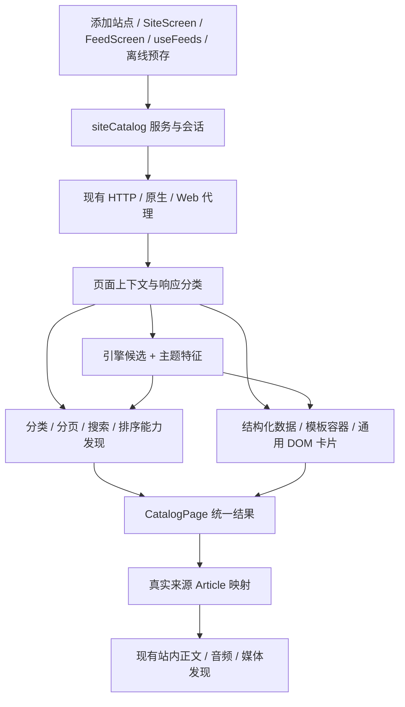

# CMS / 网页资源站接入架构审查与重构方案草案

日期：2026-10-09
基线：`5ced81d`，本地版本 `1.8.12-beta.1`
状态：已完成首轮架构审查与缺陷复现；以下为待审阅设计，尚未修改生产代码。

## 1. 用户目标与设计边界

用户要求审查、优化或重构整个 CMS 资源站适配模块，让常用 CMS 引擎具备更全面的解析规则与功能，而不是对某个域名添加特例。

本方案把“支持 CMS”定义为：识别引擎只是入口；目录、分类、分页、搜索、排序、详情和媒体分别有可追溯的规则、明确的能力状态、离线测试与跨入口一致的运行行为。无法确认引擎时，通用目录仍然可用。

沿用项目约束：客户端直连上游；Web 使用现有代理；账户可选；列表/正文缓存不上云；全文在应用内阅读；不新增状态库、路由库或生产依赖。复用现有 `linkedom`、Feed 解析、Readability、媒体嗅探、HTTP 和存储能力。

兼容性以引擎与模板变体矩阵验收，不按域名数量或新增正则数量验收。CMS 可修改模板和路由，不能把“识别成功”当成“所有功能已验证”。

## 2. 审查范围和证据

已追踪以下链路：

- 添加/重新探测：`screens/settings/CustomSourcesScreen.tsx`、`features/feedDiscovery/siteDiscovery.ts`。
- 引擎与 URL：`features/frameworkDetect/` 全部适配器、`detect.ts`、`types.ts`、`buildPageUrl.ts`。
- 目录/元信息/相关内容：`features/catalogEngine/`。
- 运行入口：`SiteScreen.tsx`、`FeedScreen.tsx`、`hooks/useFeeds.ts`、`features/prestore/sourceWindow.ts`。
- 解析与阅读：`lib/parseFeed.ts`、`sourceArticles.ts`、`resolveBody.ts`、媒体发现接线。
- 保存/导入/同步：`sources/registry/model.ts`、`sources/preferences/normalize.ts`、`customSources.ts`、`features/sync/{projection,merge}.ts`、共享订阅 DTO。
- 原始设计与测试：2026-08-19 的框架设计，以及 framework/catalog/custom-sources/pagination/正文测试。

### 2.1 已复现的缺陷

| 问题 | 实际复现 | 根因与影响 |
|---|---|---|
| 飞飞自定义主题漏识别 | 香菇影视首页 `detectFramework` 返回 `null`，但目录提取 80 条；分类页提取 50 条并发现下一页 | 只覆盖部分模板路径/播放器变量；识别与目录可用性并非一回事 |
| 跨引擎误判 | 含 `var zanpian`、共享 stui 标记、`/static/js/home.js` 与 `/vodtype/1/` 的样本返回 `maccms` | `detect.ts` 命中即停，共享主题和路由累计分数压过另一引擎的明确身份 |
| slug 目录漏掉 | `/posts/alpha`、`/posts/beta`、`/posts/gamma` 的三个 `<article>` 卡片提取为 0 条 | URL 数字模式聚类依赖过强，没有重复 DOM 容器分析 |
| URL 大小写误去重 | JSON-LD 中 `/post/Alpha` 与 `/post/alpha` 被合并 | 对完整 URL 使用 `toLowerCase()`，丢掉可能不同的路径资源 |
| 内容类型错误 | JSON-LD `Article` 被映射成 `contentType: 'video'` | `catalogHtmlToArticles` 无条件赋视频类型，影响阅读分支和媒体发现 |
| WordPress 分类分页错误 | `/blog/category/news/` 的第二页被构造成 `/blog/category/news//page/2.html` | 分类构造器默认 `.html` 规则，未复用 WordPress 的页面能力 |
| 记录偏移误作页码 | `list?offset=20` 第二页得到 `offset=2` | `PAGE_PARAM_NAMES` 把 offset 和 page 放在同一语义集合，没有步长 |
| next-link 构造器返回原页 | 通用 next-link 的第二页 URL 仍是来源首页 | 构造器返回占位原页，而站点屏直接使用它，没有执行 next-link 状态协议 |
| HTML 属性顺序敏感 | `<meta content="WordPress 6" name="generator">` 返回未识别 | regex 假定属性固定顺序 |

这些复现调用了项目现有纯函数，没有修改生产代码。香菇影视的公开脚本定义 `var feifei`，其有效 RSS 地址为 `/map-vod-id-rss-limit-100.html`；RSS 锚点只出现在被注释的页脚，不能视为标准 HTML Feed 声明。

### 2.2 从调用链确认的问题

| 位置 | 缺陷 | 后果 |
|---|---|---|
| `frameworkDetect/types.ts` | 引擎识别结果强制携带分页规则 | 无分页首页也会得到推测的“支持分页” |
| MacCMS / SeaCMS / 飞飞等适配器 | 搜索/排序从引擎默认路由直接生成 | 特定主题、子目录部署、自定义路由可能显示不可用按钮 |
| `SiteScreen.tsx` | 初始化页数为 5，再按非空结果递增 | 页码没有上游依据；无法可靠表示末页 |
| `SiteScreen.tsx` | 创建 AbortController，却不把 signal 传入 fetch；搜索不隔离请求代次 | 取消未停止传输；切站/切分类/退出搜索时可能收到旧结果 |
| `SiteScreen.tsx` | 请求分类/搜索 URL，但解析仍使用 `site.source.url` | 相对条目/封面可能按首页解析，而非当前页 |
| `FeedScreen.tsx` | 再实现一次分类 `/page/N.html`，搜索又采用另一套模板替换 | 相同来源在站点屏与 Feed 屏行为不同 |
| `FeedScreen.tsx` | 使用 `search_temp`、`fw_cat` 构造 Article | 已读/稍后读/来源查找/UA/分享上下文不再归属真实订阅 |
| `useFeeds.ts` | 首屏 `applyHeadPage` 不保存 nextUrl | 第一次加载更多会重取首屏并返回，未直接加载下一页 |
| `useFeeds.ts` 与预存 | next-link 缺少统一的已访问页与无新增条目终止策略 | 重复页/环形分页会浪费请求；入口之间终止条件不一致 |
| `catalogEngine` | 至少三个启发式条目、只取前两个路径簇、最多 80 条且不报告截断 | 少量合法结果、混合列表、slug 和长目录容易漏掉 |
| `catalogEngine` | 正则分别抽锚点；卡片父容器中的摘要、日期、标题关联不完整 | 封面/标题分离的模板容易丢元信息；导航、榜单可能混入 |
| `catalogEngine/detailMeta.ts` | 通用详情解析混入站点名称与专用模板规则 | 新增站点会继续污染共享模块，标题可能取到品牌 h1 |
| `CustomSourcesScreen.tsx` | 编辑保存分支不写入新的 frameworkHint | 重新探测结果展示成功，保存后仍然使用旧规则 |
| `App.tsx` | 站点入口筛选要求 frameworkHint 存在 | 可解析但未知引擎的首页目录无法进入完整站点浏览空间 |
| preferences / sync / contracts | frameworkHint 只作 object / unknown 透传 | 缺少版本、字段限额与运行时归一化，导入/旧客户端数据可能令调用器失效 |
| `lib/http.ts` | 对外主要返回 text，实际重定向信息没有交给目录解析 | 跳转后的相对链接与域名归属缺乏可靠上下文 |

安全相关归一化问题在此只记录设计层面的边界，不展开真实服务的利用细节。

### 2.3 基线验证

以下现有测试均通过：

- `npm run test:framework-detect`
- `npm run test:catalog-engine`
- `npm run test:custom-sources`
- `npm run test:feed-pagination`
- `npm run test:resolve-body-custom`

通过只说明现有固定样本保持行为，不能证明模板变体和运行链路完整。当前 framework 测试会断言推测 URL 存在，catalog 测试会断言所有目录条目是视频；重构时需要在保留相应旧行为兼容测试的同时，替换已确认错误的预期，不能删除测试来掩盖问题。

## 3. 方案比较

| 路径 | 优点 | 局限 |
|---|---|---|
| 逐个补 regex 与路由 | 改动快，短期能救具体模板 | 不解决 UI 分叉、能力误报、状态竞态和存储契约；后续适配成本继续增加 |
| **统一能力管线，逐步迁移现有模块（推荐）** | 共用上下文、身份评分、能力发现、解析与请求状态；适配器可独立扩展 | 涉及多入口和兼容模型，需要分阶段验证 |
| 整体替换为浏览器抓取/远程解析服务 | 某些动态页面更容易拿到 DOM | 常规阅读成本、Android/Web 差异与离线行为更复杂；远程解析不符合本地优先 |

选择第二条：保留已有稳定模块导入入口，通过 `features/siteCatalog/` 门面逐步收拢编排，不一次移动整个 HTTP、阅读器或媒体嗅探代码。

## 4. 目标架构



### 4.1 页面上下文

`CatalogPageContext` 包含：请求 URL、可确认的上游最终 URL、来源 ID、HTML/JSON/XML 负载类型、响应状态和内容类型、解析用 base URL、DOM 与预算。DOM 每页最多解析一次，复用现有 linkedom；不执行页面脚本。

优先用已确认的最终上游 URL 解析相对地址；有合法 `<base href>` 时采用受约束的 base。若某种 transport 无法提供最终 URL，明确记录未知，退回请求 URL，不能把 Web 代理自身的 `response.url` 当成上游 URL。需要在现有 HTTP helper 增加可选页面元信息返回，并在原生、隧道、Vite 和 Web edge 层贯通；原有 `fetchAbsoluteText` 保持兼容。

响应分类至少区分：正常目录、详情页、空结果、登录/挑战/限制页、动态空壳、未支持格式、网络失败。复用已有 blocked/encoding 判断，不把这些响应全部映射为“暂无内容”。

### 4.2 引擎、主题和能力分离

适配器注册表返回 `DetectionCandidate[]`，每个候选包含 engineId、score、明确身份信号、辅助信号、矛盾信号与可选主题标记。全部候选比较后选择，不按函数调用顺序提前返回。

明确 generator/引擎配置标识优先于共享主题。stui/vfed/conch 等共享模板仅辅助识别，不独立证明 CMS。冲突或分差不足时保留 unknown/generic，目录和页面能力照常提取。已有 `nnyy` 作为站点/模板补丁注册，不再与通用 CMS 引擎身份混用。

能力分别带 `observed`、`inferred` 或 `unavailable` 的证据状态。引擎识别不能凭空产生搜索、排序、分页权限。

### 4.3 分类与导航

先读语义导航容器、导航 role、侧栏分类、面包屑和模板选择器，再用已确认 CMS 路由补充。基于 DOM 读取属性，兼容属性顺序、单双引号、无引号以及实体编码。

分类保留父子关系和真实 URL；去除首页/登录/榜单工具链接；相同 URL 去重而不强制合并不同路径的同名栏目。所有相对地址用当前上下文归一化。子目录部署不能默认退到站点根目录。

未明确的导航链接仅作为候选；添加探测可取一个高可信栏目做目录验证，不能递归遍历整站。

### 4.4 分页协议

分页是页面/查询状态的属性，分别支持：

- `none`：本页没有上游分页，不请求猜测的第二页。
- `next-link`：跟随已解析下一页；支持锚点 rel=next、图标按钮、aria-label、数字分页与禁用末页。
- `page-param`：明确页码参数与首屏起点。
- `offset-param`：明确起始偏移和步长；不从参数名称猜步长。
- `path-template`：从实际分页锚点归纳或使用经过样本验证的适配器规则。
- `cursor`：仅对显式公开结构化接口，保留原始不透明游标。

优先级：实际下一页/数字链接 > 当前路径与适配器共同确认的规则 > 无分页。路径模板记录哪些上下文可用，首页规则不能直接覆盖分类或搜索。

每个会话持有 `visitedPageKeys`、当前/下一请求、条目去重集合、请求数上限与页内容指纹。重复游标、返回原页、重复页指纹或连续两页无新增有效条目时停止，区分 exhausted 与 error；错误保留原列表并可重试。首页成功时立即记录下一页。

无可靠总页数时只提供上一页/下一页和已访问页，不能伪造总页数；页面明确给出的总页数也需要结构校验。任意跳页只用于有实际页链接或可靠路径/页码规则的站点。

### 4.5 搜索、排序与筛选

`CatalogRequest` 是纯数据计划：`GET | POST`、URL、可选 form 字段与允许的公开请求参数。发现表单的 action/method、命名搜索输入、公开 hidden 参数；只把确认的关键词字段标记为占位符。解析支持引擎的 data-action 等模板字段。

GET 与 POST 搜索使用同一请求与解析管线。关键词仅按字段/路径对应规则编码一次；保留子目录、分类和分页状态。结果拥有自己的分页协议和会话，不借用主列表分页。

排序/筛选优先取真实链接、select 与表单选项。只有上游可用的能力才显示；排序链接可以是菜单型能力，不限定为全站通用几个 key。CMS 默认排序只可作为待验证候选，不对搜索强行附加列表排序参数。切分类、搜索、排序、筛选时创建独立会话状态。

### 4.6 目录解析与统一模型

抽取层：结构化列表（JSON-LD ItemList/CollectionPage、微数据等）→ 已确认引擎/模板的容器规则 → 通用 DOM 重复卡片 → 保留旧启发式回退。

重点修正：

- DOM 以重复 `article/li/卡片容器` 聚类，支持 slug、无图文本、图片与标题分开、懒加载/srcset/picture。
- 页内正文主列表与导航、侧栏、排行榜、相关推荐分区，避免仅按链接数量选择结果。
- JSON-LD 列表与 DOM 结果按条目补充元信息，单个详情 Article 不能伪装成列表；支持正常单条搜索结果，并降低不确定目录候选的置信度。
- 保留摘要、日期、封面与内容类型；不可靠日期回落抓取时间并保留 `hasRealDate: false`。
- 可配置有界条目上限（设计默认 200），输出 `truncated`，不静默漏掉第 81 条以后的内容。
- URL 去重只规范协议/host、片段与明确的跟踪参数；保留路径和业务参数大小写与顺序语义。暂不更换已有 Article 的 URL 哈希 ID 规则。

`CatalogPage` 输出 items、分类/能力快照、分页状态、页面类型、置信度、截断标记、结构化诊断。`CatalogItem` 增加明确 article/video 或未知类型；未知目录默认普通文章，只有结构化 VideoObject、视频 CMS 条目规则或详情媒体证据才进入视频路径。音频沿现有 Article/audioUrl 契约，下载资料仍以正文及下载链接呈现，不为此新增 SourceKind。

映射 Article 时始终用真实 sourceId 和来源信息，解析 base URL 单独传入；分类/搜索共享稳定条目 ID，保留已读、稍后读、分享、UA 和正文解析上下文。

### 4.7 详情与媒体

引擎/主题补丁提供标题、简介、正文、封面、日期和公开分集/播放列表的选择器或结构化解析函数；通用字段抽取优先 JSON-LD/OG/主内容 heading，不取页首品牌标题。

仍由 `resolveBody` 负责站内正文、清洗和缓存，Readability 负责通用文章回退；已有媒体嗅探负责播放地址发现和失效刷新。CMS 适配器只提供页面线索，不能在目录层新建另一套播放器/嗅探器。相关推荐与主目录分开抽取，来自上游页面，不引入推荐服务。

当前阅读器需要新增的分集能力必须同时覆盖切换后的取消、媒体状态重置和可分享来源信息；不对普通图文 CMS 显示影视控件。

### 4.8 服务与会话边界

建议门面文件：

```text
features/siteCatalog/
  types.ts              请求、上下文、统一结果、版本化配置
  context.ts            DOM 与页面类型/编码/URL 上下文
  adapterRegistry.ts    引擎、主题与站点补丁注册
  detection.ts          候选评分与冲突仲裁
  capabilities.ts       分类/分页/搜索/排序发现编排
  requests.ts           纯请求构造与验证
  service.ts            获取→归一化→解析，复用现有 HTTP
  session.ts            与 UI 无关的分页/去重/错误状态机
  useCatalogSession.ts  React 取消与状态接线
  profile.ts            归一化、版本兼容与 legacyHint 适配
```

`catalogEngine` 继续负责抽取；`frameworkDetect` 原有 API 作为过渡包装保留，所有新生产调用转到门面；不同时维护两套新旧决策逻辑。

每个请求携带 AbortSignal 和 generation token，覆盖探测/分类/搜索/翻页/详情切换。卸载、清空搜索、切站和配置更新会取消旧请求；即使底层原生传输不能立即取消，旧代结果也不得回写。SiteScreen 与 FeedScreen 共用 hook；useFeeds 与离线预存共用纯 session/request/parse 层，不耦合 React。

## 5. 常用 CMS 规则覆盖矩阵

以下是此次拟覆盖的引擎清单，不是现状支持声明；“常用”按资源站/内容站接入范围划定，不声称市场占有率排序。

| 引擎族 | 覆盖要求 |
|---|---|
| MacCMS v8/v10 | 视频与文章模型；经典路由、伪静态、自定义栏目；classic、stui、vfed、conch、mxone/mxpro、ds3、wntheme 等已有主题；公开 XML/JSON 内容接口仅在显式提供或页面声明且结构验证后使用 |
| SeaCMS | 动态/静态目录、播放器与导航特征；分页/搜索从实际页面确认；共享主题不能误判引擎 |
| 飞飞 CMS | 老/新变量与 Public/Tpl 等结构；GET/POST 搜索、模板自定义地址、别名分类、分页；香菇影视只是变体样本 |
| 赞片 CMS | 明确身份优先；共享模板、分类、搜索、排序与分页按页面验证 |
| DedeCMS、帝国 CMS、PbootCMS、易优 CMS、JEECMS | 图文/下载资源目录；静态与动态 URL、栏目别名、搜索表单、详情正文与混合列表 |
| WordPress、Typecho、Z-Blog、Ghost | 原生 Feed 优先提供选择，同时支持 HTML 目录、分类/tag、子目录安装、不同分页形式与搜索；API 不替代 HTML 兼容回退 |
| Drupal、Joomla | 页面公开列表、分类、分页和搜索；识别与主题无关；禁止仅凭识别生成猜测端点 |
| Hugo、Hexo | generator 属性变体、无图 slug 列表、分类/tag、多分页；没有上游搜索时不假装支持 |
| unknown/generic | 上述通用 DOM/结构化列表/分类/分页/搜索发现，未识别引擎也进入站点浏览空间 |

每个引擎的身份证据和协议规则以官方仓库/模板/文档为依据，准备离线 fixtures 后才能标记支持。新增资料不足的变体显示“通用解析”而不是编造规则；官方默认模板只是矩阵一部分。

本轮不新增 Discuz/Discourse 等独立社区工作区，不把已有知乎/Linux.do 工作区合并进 CMS 模块。目录读取可以走通用路径，登录与社区交互不在本方案。

## 6. 探测预算与可维护性

- 默认一次首屏请求；必要时至多三个附加公开请求，总计四次、并发最多二、总时间 25 秒；页面响应大小默认上限 2 MiB，并在 transport 可行处尽早限制。
- 附加请求只用于一个高可信栏目、显式 RSS/API 地址或明确相关页面；不扫描常见路径字典、不递归抓全站、不为识别下载任意外部脚本。
- 纯解析在本地完成；仅调用现有原生/HTTP/代理。支持 diagnostics 把网络失败、识别冲突和解析失败分开，界面中文说明；日志走 `log.catalog`，不记录凭据或响应正文。
- 规则版本随应用发布，适配器有自己的样本与能力声明；不执行远端 JavaScript 规则，不新增云解析依赖。
- 规则更新后，在用户重新探测或持续解析失效时进行一次有界的能力刷新；能解析的已有列表/离线正文保持可读，不能每次刷新都做整站探测。

## 7. 保存、迁移与同步契约

建议增加可选的 `NewsSource.catalogProfile`（`version: 1`），与旧 `frameworkHint` 分开：包含 siteRoot、可选引擎/主题身份、已确认能力的可序列化请求规则、rulesRevision；不保存 DOM、响应、运行会话、cookies/token、正文或搜索历史。

选择独立字段的原因：旧 FrameworkHint 强制有框架和分页；复用它会继续把引擎身份与页面能力绑在一起。保留旧字段供旧版本读取，新增配置只有经归一化和版本判断才能执行。

兼容步骤：

1. 无新配置的旧来源通过纯函数转换成运行配置；原有 hint 的推测能力标记 inferred，用首次真实页面能力覆盖，不能直接宣称已验证。
2. sourceId、source URL 与现有 URL 哈希 Article ID 不因适配器更换而变；已读/稍后读/阅读位置/正文缓存不迁移。
3. 添加、编辑、重新探测统一保存配置；编辑 URL 时旧站点配置不可继续套用到新 URL；探测失败不能覆盖仍有效的旧配置。
4. 新配置随自建来源进入现有可选同步 projection/outbox；contracts 增加可选 opaque 字段供旧协议兼容，客户端做严格版本化归一化。服务端不执行规则，不引入解析业务逻辑。
5. 备份/恢复、normalize 和 sync merge 使用同一 profile 校验；字段长度、数量、URL/请求规则和允许操作有界。未知未来版本安全降级到通用目录，保留原始合法配置用于不丢失的导出。
6. 旧客户端忽略新字段时至少保留旧来源/列表首屏；新版本重新发现能力。保留准确可表达的 legacyHint，不为旧客户端填入假分页。
7. 旧目录列表的错误 contentType 通过局部列表 cacheVersion 更新处理，正文 cache、阅读状态与普通 RSS 不清空。

新增持久化字段及其同步、备份兼容属于公开契约变更；实施时必须更新 architecture、用户指南和 AGENTS 入口地图，并覆盖协议兼容测试。

## 8. 验收矩阵

每个引擎至少有：官方/default 模板正例、去 generator/自定义模板变体、与其他引擎共享主题的冲突例、普通非 CMS 页面负例。功能无上游实现时，测试不可用状态，不能为了完整表格强造支持。

通用必测：

- 首页/分类/详情/搜索/空结果/挑战页/动态空壳类型区分。
- 无图 slug、分离标题与封面、嵌套标签、单双引号/属性乱序、中文实体、srcset、相对地址、合法 base、子目录、跳转后页面上下文。
- 图文、视频、音频与下载资源混合类型；单条搜索结果；上游日期与无日期；主列表/导航/榜单/相关推荐分离；超过 80 条的截断语义。
- 页码/offset/路径/next-link/cursor；禁用末页；重复页、循环页、没有新增条目；搜索分页/排序分页/栏目独立分页。
- GET/POST 搜索、重复参数、编码一次、公开 hidden 参数、实际排序/筛选项和未知能力。
- sourceId 和条目 ID 不变；搜索/分类条目能复用已读、稍后读、分享、UA 和正文上下文。
- 交错请求：慢站 A→快站 B、慢分类→新分类、搜索→清空、分页→切排序、组件卸载；旧响应不回写、不误清空 loading。
- 探测重试、错误保留列表、取消、预算耗尽；重新探测保存；旧 hint、无 hint、新 profile、未知版本、备份与同步往返。
- Android 原生/代理、Web 开发/生产 transport 元信息与乱码处理；Android cloud/local 边界不变。

现有测试命令继续保留；增加独立 `site-catalog` 会话/探测/请求集成测试和相应 fixtures，强化现有 framework/catalog 测试。离线样本是稳定验收，实网 smoke 只验证上游当前行为，两者分别报告。

## 9. 实施顺序建议

1. 先建立缺陷回归样本、页面上下文与纯请求/分页协议，修复 ID/内容类型/重新探测保存。
2. 引入适配器注册与候选评分，通用 DOM 分类/目录/搜索/分页能力发现，迁移当前所有引擎。
3. SiteScreen、FeedScreen、useFeeds 和预存使用统一服务/会话；建立请求取消、错误提示与分页界面。
4. 完成新增 CMS 规则矩阵与详情字段补丁；公开接口支持与媒体/分集接线按实际页面能力验收。
5. 完成配置版本兼容、备份/同步、文档和 Android/Web 验证。

以上是依赖顺序，不是已批准的实施计划。书面设计审阅后再制定具体文件、任务与测试步骤；在整个阶段完成前，不应宣称“全面支持所有 CMS”。

## 10. 核对的上游来源

- [苹果 CMS 官方仓库](https://github.com/magicblack/maccms10)
- [飞飞 CMS 仓库](https://github.com/feifeicms/feifeicms)
- [Typecho 官方仓库](https://github.com/typecho/typecho)
- [PbootCMS 仓库](https://github.com/Pbootcms/Pbootcms)
- [DedeCMS 官方网站](https://www.dedecms.com/)
- [香菇影视公开模板脚本](https://www.xiangguys.com/Public/js/system.js?4.3.201206)

这些来源确认引擎/产品和实网样本来源；本轮没有声称已验证新增引擎的全部 URL/接口协议。实现具体适配规则前需继续读取对应官方代码/文档并把事实变成 fixtures。
